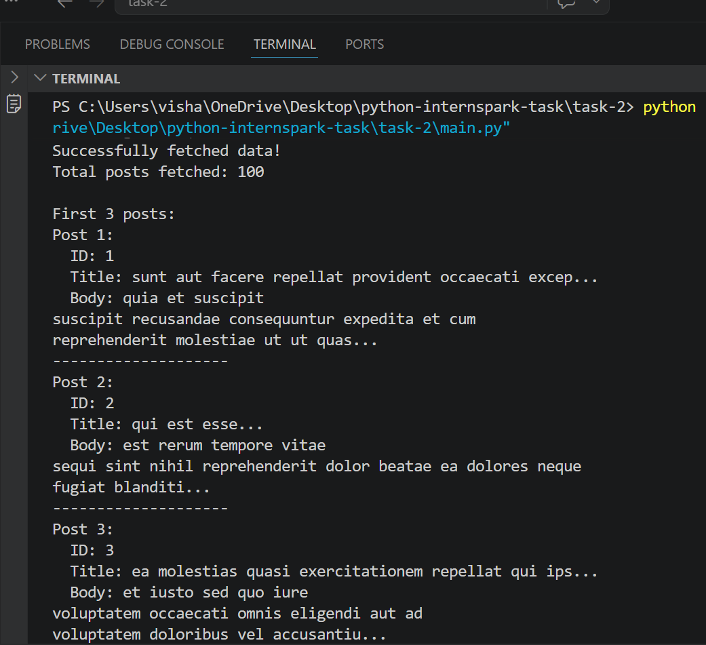
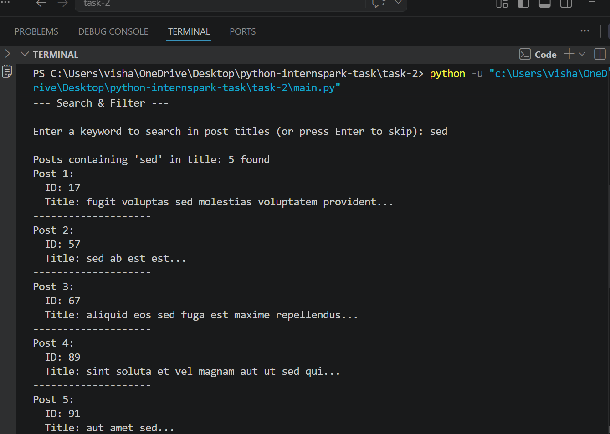
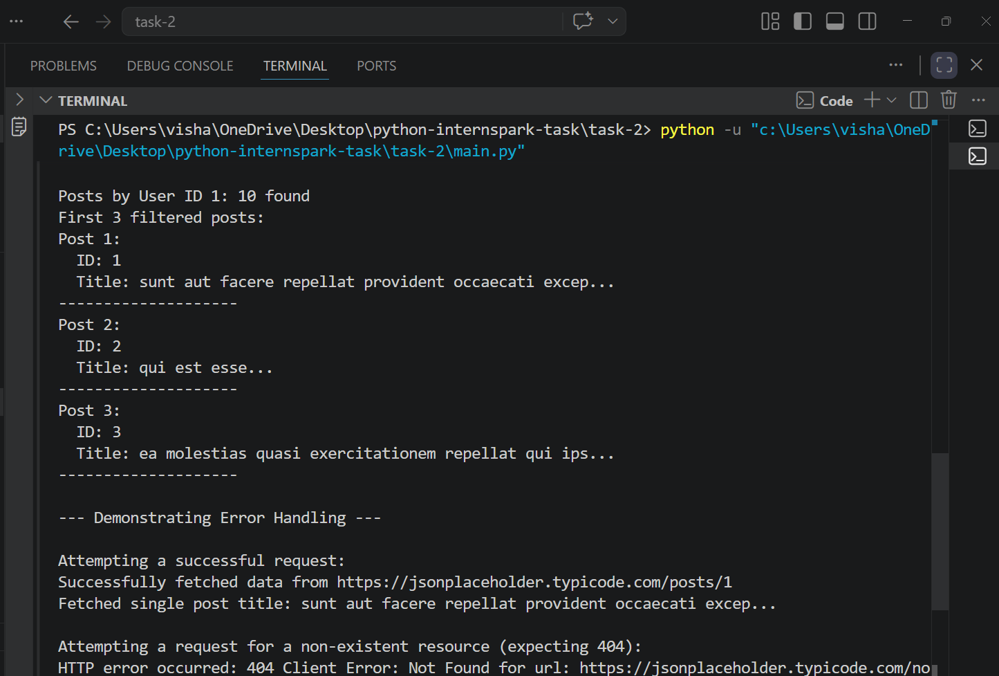

# pythondev-task2 — API Integration (Weather / Crypto / News)

## 📌 Goal
Fetch API data using Python's `requests` library, parse the JSON response, and apply search/filter logic with proper error handling.

---

## 🗂️ Project Structure

```
pythondev-task2/
│
├── main.py          # Main Python script
├── README.md        # Project documentation
└── screenshots/
    ├── output1.png  # Fetching & displaying posts
    ├── output2.png  # Search/filter by keyword & userId
    └── output3.png  # Error handling demonstration
```

---

## ⚙️ Requirements

- Python 3.x
- `requests` library

Install dependencies:
```bash
pip install requests
```

---

## 🚀 How to Run

```bash
python main.py
```

When prompted, enter a keyword to search post titles (or press Enter to skip).

---

## 📖 Code Walkthrough

### 1. Fetching Data using the `requests` Library

We use the **JSONPlaceholder API** — a free fake REST API for testing and prototyping.

```python
import requests

api_url = "https://jsonplaceholder.typicode.com/posts"
response = requests.get(api_url)

if response.status_code == 200:
    posts = response.json()
    print(f"Total posts fetched: {len(posts)}")
```

- `requests.get()` sends an HTTP GET request to the API endpoint.
- We check `status_code == 200` to confirm success.
- `.json()` parses the raw JSON response into a Python list of dictionaries.

**Output:**


---

### 2. Applying Filtering / Search Logic

Two types of filtering are demonstrated:

**a) Keyword search in post titles:**
```python
keyword = input("Enter a keyword to search in post titles: ").strip().lower()
filtered_by_keyword = [post for post in posts if keyword in post['title'].lower()]
```

**b) Filter by userId:**
```python
user_id_to_filter = 1
filtered_posts = [post for post in posts if post['userId'] == user_id_to_filter]
```

- List comprehensions make filtering clean and Pythonic.
- The keyword search is **case-insensitive** using `.lower()`.
- userId filter demonstrates field-based filtering on parsed JSON data.

**Output:**


---

### 3. Handling API Errors

A dedicated function wraps the request in a `try/except` block to handle all common API failure scenarios:

```python
def fetch_data_with_error_handling(url):
    try:
        response = requests.get(url)
        response.raise_for_status()  # Raises HTTPError for 4xx/5xx
        return response.json()
    except requests.exceptions.HTTPError as http_err:
        print(f"HTTP error occurred: {http_err}")
    except requests.exceptions.ConnectionError as conn_err:
        print(f"Connection error occurred: {conn_err}")
    except requests.exceptions.Timeout as timeout_err:
        print(f"Timeout error occurred: {timeout_err}")
    except requests.exceptions.RequestException as req_err:
        print(f"An unexpected error occurred: {req_err}")
    except ValueError:
        print(f"Error: Could not decode JSON response.")
    return None
```

| Scenario | Exception Handled |
|---|---|
| 404 Not Found | `requests.exceptions.HTTPError` |
| No internet / bad URL | `requests.exceptions.ConnectionError` |
| Request takes too long | `requests.exceptions.Timeout` |
| Any other request issue | `requests.exceptions.RequestException` |
| Response isn't valid JSON | `ValueError` |

**Output:**


---

## 🖼️ Screenshots

### Output 1 — Fetching & Displaying Posts


### Output 2 — Search & Filter Results


### Output 3 — Error Handling Demo


---

## 🌐 API Used

| API | URL | Purpose |
|---|---|---|
| JSONPlaceholder | https://jsonplaceholder.typicode.com/posts | Free fake REST API for testing |

---

## ✅ Task Requirements Checklist

- [x] Use `requests` module
- [x] Parse JSON response
- [x] Add search/filter logic
- [x] Handle API errors gracefully
- [x] Python script deliverable
- [x] Screenshots of output

---

## 👤 Author

**[VISHAKHA OJHA]**  
